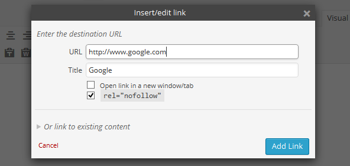

# Rel Nofollow Checkbox

This is a simple WordPress plugin to add a checkbox in the insert/edit link popup for including `nofollow` attribute.

Compatible with **WordPress v4.0.1**.

## Screenshots

## Installation

1. Download the latest zip file and extract the `rel-nofollow-checkbox` directory.
2. Upload it to your `/wp-content/plugins/` directory.
3. Activate `Rel Nofollow Checkbox` on the `Plugins` menu in WordPress.

## License

Copyright (c) 2014 [Fábio Santos](http://www.fabiosantos.pt). See the LICENSE
file for license rights and limitations (GPLv2).
